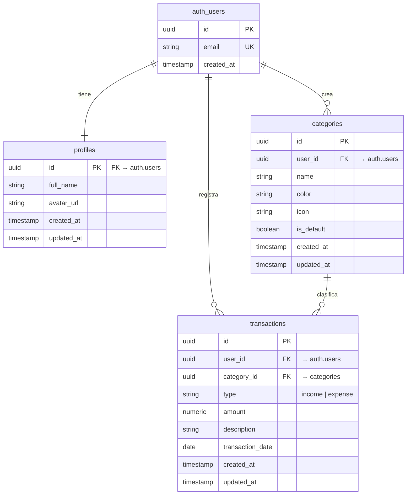

# Esquema de Base de Datos — Control de Finanzas Personales

**Base de datos:** Supabase (PostgreSQL 15)
**Última actualización:** 2026-05-01 00:00

---

## Diagrama ER



---

## Índice de Tablas

| # | Tabla | Descripción | RLS | Políticas |
|---|-------|-------------|-----|-----------|
| 1 | [profiles](#profiles) | Datos extra del usuario | SI | 2 |
| 2 | [categories](#categories) | Categorías de transacciones por usuario | SI | 4 |
| 3 | [transactions](#transactions) | Ingresos y gastos del usuario | SI | 4 |

---

## Tablas

### profiles

> Extiende `auth.users` con datos adicionales del perfil. Se crea automáticamente al registrarse via trigger.

| Columna | Tipo | Nullable | Default | Descripción |
|---------|------|----------|---------|-------------|
| `id` | `uuid` | NO | - | PK, FK → `auth.users(id)` |
| `full_name` | `text` | SI | `null` | Nombre completo del usuario |
| `avatar_url` | `text` | SI | `null` | URL del avatar |
| `created_at` | `timestamptz` | NO | `now()` | Fecha de creación |
| `updated_at` | `timestamptz` | NO | `now()` | Última actualización |

**Índices:**

| Nombre | Columnas | Tipo |
|--------|----------|------|
| `profiles_pkey` | `id` | PRIMARY KEY |

**Foreign Keys:**

| Columna | Referencia | On Delete |
|---------|------------|-----------|
| `id` | `auth.users(id)` | CASCADE |

**Políticas RLS:**

```sql
-- El usuario solo ve su propio perfil
CREATE POLICY "profiles_select_own" ON profiles
  FOR SELECT USING (auth.uid() = id);

-- El usuario solo actualiza su propio perfil
CREATE POLICY "profiles_update_own" ON profiles
  FOR UPDATE USING (auth.uid() = id);
```

**Triggers:**

| Nombre | Evento | Función |
|--------|--------|---------|
| `on_auth_user_created` | AFTER INSERT ON auth.users | `handle_new_user()` |
| `on_profiles_updated` | BEFORE UPDATE | `handle_updated_at()` |

---

### categories

> Categorías de transacciones. Cada usuario tiene sus propias categorías. Se insertan categorías por defecto al crear el perfil.

| Columna | Tipo | Nullable | Default | Descripción |
|---------|------|----------|---------|-------------|
| `id` | `uuid` | NO | `gen_random_uuid()` | PK |
| `user_id` | `uuid` | NO | - | FK → `auth.users(id)` |
| `name` | `text` | NO | - | Nombre de la categoría (ej: "Comida") |
| `color` | `text` | NO | `'#6366f1'` | Color hex para el gráfico |
| `icon` | `text` | SI | `null` | Nombre del ícono de Lucide React |
| `is_default` | `boolean` | NO | `false` | True si es categoría pre-cargada |
| `created_at` | `timestamptz` | NO | `now()` | Fecha de creación |
| `updated_at` | `timestamptz` | NO | `now()` | Última actualización |

**Índices:**

| Nombre | Columnas | Tipo |
|--------|----------|------|
| `categories_pkey` | `id` | PRIMARY KEY |
| `categories_user_id_idx` | `user_id` | INDEX |

**Foreign Keys:**

| Columna | Referencia | On Delete |
|---------|------------|-----------|
| `user_id` | `auth.users(id)` | CASCADE |

**Políticas RLS:**

```sql
CREATE POLICY "categories_select_own" ON categories
  FOR SELECT USING (auth.uid() = user_id);

CREATE POLICY "categories_insert_own" ON categories
  FOR INSERT WITH CHECK (auth.uid() = user_id);

CREATE POLICY "categories_update_own" ON categories
  FOR UPDATE USING (auth.uid() = user_id);

CREATE POLICY "categories_delete_own" ON categories
  FOR DELETE USING (auth.uid() = user_id);
```

**Triggers:**

| Nombre | Evento | Función |
|--------|--------|---------|
| `on_categories_updated` | BEFORE UPDATE | `handle_updated_at()` |

---

### transactions

> Registro de todas las transacciones del usuario (ingresos y gastos).

| Columna | Tipo | Nullable | Default | Descripción |
|---------|------|----------|---------|-------------|
| `id` | `uuid` | NO | `gen_random_uuid()` | PK |
| `user_id` | `uuid` | NO | - | FK → `auth.users(id)` |
| `category_id` | `uuid` | SI | `null` | FK → `categories(id)` |
| `type` | `text` | NO | - | `'income'` o `'expense'` |
| `amount` | `numeric(12,2)` | NO | - | Monto positivo siempre |
| `description` | `text` | SI | `null` | Descripción opcional |
| `transaction_date` | `date` | NO | `CURRENT_DATE` | Fecha de la transacción |
| `created_at` | `timestamptz` | NO | `now()` | Fecha de creación del registro |
| `updated_at` | `timestamptz` | NO | `now()` | Última actualización |

**Constraints:**

```sql
-- El tipo solo puede ser 'income' o 'expense'
ALTER TABLE transactions ADD CONSTRAINT transactions_type_check
  CHECK (type IN ('income', 'expense'));

-- El monto siempre es positivo
ALTER TABLE transactions ADD CONSTRAINT transactions_amount_positive
  CHECK (amount > 0);
```

**Índices:**

| Nombre | Columnas | Tipo |
|--------|----------|------|
| `transactions_pkey` | `id` | PRIMARY KEY |
| `transactions_user_id_idx` | `user_id` | INDEX |
| `transactions_date_idx` | `transaction_date` | INDEX |
| `transactions_type_idx` | `type` | INDEX |

**Foreign Keys:**

| Columna | Referencia | On Delete |
|---------|------------|-----------|
| `user_id` | `auth.users(id)` | CASCADE |
| `category_id` | `categories(id)` | SET NULL |

**Políticas RLS:**

```sql
CREATE POLICY "transactions_select_own" ON transactions
  FOR SELECT USING (auth.uid() = user_id);

CREATE POLICY "transactions_insert_own" ON transactions
  FOR INSERT WITH CHECK (auth.uid() = user_id);

CREATE POLICY "transactions_update_own" ON transactions
  FOR UPDATE USING (auth.uid() = user_id);

CREATE POLICY "transactions_delete_own" ON transactions
  FOR DELETE USING (auth.uid() = user_id);
```

**Triggers:**

| Nombre | Evento | Función |
|--------|--------|---------|
| `on_transactions_updated` | BEFORE UPDATE | `handle_updated_at()` |

---

## Historial de Migraciones

| # | Archivo | Fecha | Descripción | Estado |
|---|---------|-------|-------------|--------|
| 1 | `00001_initial_schema.sql` | 2026-05-01 | Schema inicial: profiles, categories, transactions | Pendiente |

---

## Funciones de Base de Datos

### handle_updated_at()
> Auto-actualiza `updated_at` en cada UPDATE.

```sql
CREATE OR REPLACE FUNCTION handle_updated_at()
RETURNS TRIGGER AS $$
BEGIN
  NEW.updated_at = NOW();
  RETURN NEW;
END;
$$ LANGUAGE plpgsql;
```

### handle_new_user()
> Crea un perfil vacío y categorías por defecto cuando se registra un nuevo usuario.

```sql
CREATE OR REPLACE FUNCTION handle_new_user()
RETURNS TRIGGER AS $$
BEGIN
  -- Crear perfil
  INSERT INTO public.profiles (id)
  VALUES (NEW.id);

  -- Insertar categorías por defecto
  INSERT INTO public.categories (user_id, name, color, icon, is_default)
  VALUES
    (NEW.id, 'Comida',      '#ef4444', 'utensils',     true),
    (NEW.id, 'Gym',         '#f97316', 'dumbbell',      true),
    (NEW.id, 'Streetwear',  '#8b5cf6', 'shirt',         true),
    (NEW.id, 'Transporte',  '#3b82f6', 'car',           true),
    (NEW.id, 'Salud',       '#10b981', 'heart-pulse',   true),
    (NEW.id, 'Ocio',        '#f59e0b', 'gamepad-2',     true),
    (NEW.id, 'Sueldo',      '#22c55e', 'banknote',      true),
    (NEW.id, 'Otros',       '#6b7280', 'more-horizontal', true);

  RETURN NEW;
END;
$$ LANGUAGE plpgsql SECURITY DEFINER;
```

---

## Resumen RLS

| Tabla | SELECT | INSERT | UPDATE | DELETE |
|-------|--------|--------|--------|--------|
| `profiles` | Propio | Via trigger | Propio | NO |
| `categories` | Propio | Propio | Propio | Propio |
| `transactions` | Propio | Propio | Propio | Propio |

---

## Tipos TypeScript Generados (referencia)

```typescript
// Generados con: supabase gen types typescript --project-id [id] > src/types/database.types.ts
// Este bloque se actualiza al ejecutar el comando de generación

export type TransactionType = 'income' | 'expense'

export interface Database {
  public: {
    Tables: {
      profiles: { ... }
      categories: { ... }
      transactions: { ... }
    }
  }
}
```
